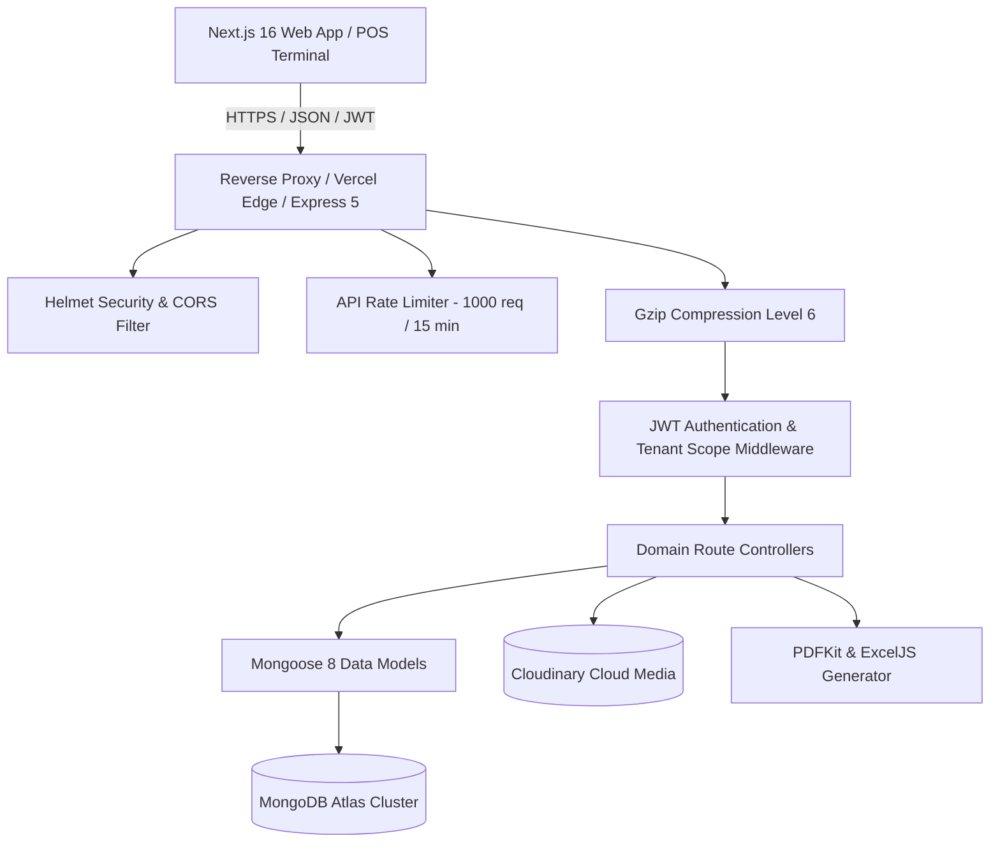

<div align="center">

# ⚡ CityRock POS — Backend REST API Engine

### High-Performance, Multi-Tenant Retail & Point-of-Sale Backend Engine

[](https://nodejs.org)
[](https://expressjs.com)
[](https://mongoosejs.com)
[](https://github.com/anzamuneebkhanofficial/cityrock-pos-web)
[](https://vercel.com)
[](#)

---

### 🌐 Companion Web Platform
> **Frontend Repository:** **[cityrock-pos-web](https://github.com/anzamuneebkhanofficial/cityrock-pos-web)**  
> This backend API is designed to power the CityRock POS Next.js 16 & React 19 frontend application.

---

</div>

## 📖 Overview

**CityRock POS API** is an enterprise-grade, multi-tenant Point of Sale (POS) and retail management backend service. Built with **Express 5**, **Node.js 20+**, and **MongoDB (Mongoose)**, it provides strict tenant data isolation, dynamic role-based access control (RBAC), real-time inventory synchronization, PDF invoice streaming, and comprehensive business intelligence reports.

Architected to run seamlessly both as a **standalone stateful server** (Render, Docker, VPS) and as **serverless functions** (Vercel Serverless).

---

## 🏗️ System Architecture



---

## ✨ Core Features & Modules

### 1. 🔐 Multi-Tenant Identity & Access (RBAC)
- Multi-tier roles: **Super Admin**, **Tenant Owner**, **Store Manager**, and **Cashier**.
- Dynamic Super Admin authentication via secure environment keys.
- JWT-based authentication with stateless bearer token verification.
- Two-factor / Email OTP verification workflows and password reset pipelines.

### 2. 🏬 Multi-Store & Staff Management
- Single tenant can manage multiple physical store branches independently.
- Granular staff invitation and assignment to specific physical outlets.
- Complete audit logging (`AuditLog`) for tracking administrative and transactional events.

### 3. 📦 Products, Categories & Barcode Inventory
- SKU & Barcode indexing for instant cashier lookup.
- Stock level tracking per store with automatic low-stock triggers.
- Batch adjustment, inventory valuation reports, and Excel spreadsheet import/export via `exceljs`.

### 4. 🛒 Point-of-Sale (POS) & Billing Engine
- High-concurrency checkout transactions with atomic inventory decrements.
- Multiple payment methods: Cash, Card, Bank Transfer, Split Payments.
- Automated receipt and branded PDF invoice generation using `pdfkit`.
- Full sales return and refund tracking with automated stock replenishment.

### 5. 📊 Analytics, Reports & BI
- Hourly sales distribution analysis for peak-hour cashier staffing.
- Cashier performance metrics and cashier shift reconciliation.
- Category market share breakdown and store-by-store sales comparison.
- Real-time gross margin and net profit calculations.

### 6. 👑 Super Admin Platform Controls
- Tenant onboarding, lifecycle status (Active, Suspended, Expired), and trial enforcement (`TRIAL_DURATION`).
- Subscription plan management (tier limits, custom features).
- Manual bank transfer payment verification and transaction proof review.
- Built-in multi-tenant ticketing and customer support system.

### 7. 🛡️ Enterprise Security & Performance
- Built-in protection with **Helmet 8** (Cross-Origin Resource Policy configured for cloud media).
- **Express-rate-limit** DDoS and brute-force mitigation (1,000 requests per 15-minute sliding window).
- **Compression** middleware with Gzip level 6 and 1KB payload thresholds.
- Dynamic CORS whitelist supporting production Vercel domains, preview deployments, and local environments.

---

## 🛠️ Technology Stack

| Component | Technology | Version / Details |
| :--- | :--- | :--- |
| **Runtime** | Node.js | `>= 20.0.0` (ES Modules) |
| **Framework** | Express.js | `^5.2.1` |
| **Database** | MongoDB | via Mongoose `^8.9.5` |
| **Security** | Helmet & Rate-Limit | `helmet ^8.0.0`, `express-rate-limit ^7.5.0` |
| **Authentication** | JWT & Bcrypt | `jsonwebtoken ^9.0.2`, `bcryptjs ^2.4.3` |
| **Media Storage** | Cloudinary | `cloudinary ^2.11.0` |
| **Document Generation** | PDFKit & ExcelJS | `pdfkit ^0.16.0`, `exceljs ^4.4.0` |
| **Compression** | Compression | `compression ^1.7.5` (Level 6) |

---

## 📁 Directory Structure

```text
backend/
├── api/
│   └── index.js             # Vercel serverless entrypoint
├── src/
│   ├── app.js               # Express application configuration & middleware
│   ├── config/
│   │   ├── db.js            # MongoDB Mongoose connection manager
│   │   └── cloudinary.js    # Cloudinary SDK media configuration
│   ├── controllers/         # Business logic handlers
│   ├── middleware/          # Auth, Tenant Scoping, Rate Limiting, Error Handlers
│   ├── models/              # 18 Mongoose Data Schemas (Tenant, User, Sale, etc.)
│   ├── routes/              # Express API route declarations
│   ├── services/            # Reusable business logic (PDF generation, Excel import)
│   └── utils/               # Helpers & error wrappers
├── uploads/                 # Local temporary disk storage
├── .env.example             # Documented environment variables template
├── package.json             # Dependencies and scripts
├── server.js                # Standalone Node HTTP server entrypoint
└── vercel.json              # Vercel serverless routing configuration
```

---

## 📡 API Endpoints Reference

All API routes are mounted under `/api/v1`:

| Endpoint Prefix | Description | Auth Required |
| :--- | :--- | :--- |
| `GET /` | API Root Health & Cluster Diagnostic Status | No |
| `GET /health` | Uptime, Database Status & Engine Information | No |
| `/api/v1/auth` | Login, Signup, OTP Verify, Password Reset, Profile | Partial |
| `/api/v1/admin` | Super Admin Stats, Tenant Management, Subscriptions | Yes (Super Admin) |
| `/api/v1/tenant` | Stores, Staff, Subscription, Payment Proofs, Tickets | Yes (Tenant Admin) |
| `/api/v1/products` | CRUD Products, Bulk Import/Export, Barcode Search | Yes |
| `/api/v1/inventory`| Real-time Stock Tracking, Stock Adjustments, Low Stock | Yes |
| `/api/v1/sales` | POS Checkout, Returns, Receipts, PDF Invoices | Yes |
| `/api/v1/reports` | Summary, Cashier Metrics, Category Share, Hours | Yes |
| `/api/v1/customers`| Customer CRM, Purchase History, Store Credits | Yes |
| `/api/v1/suppliers`| Supplier Catalog & Purchase Orders (PO) | Yes |

---

## ⚙️ Environment Variables

Copy `.env.example` to `.env` in the `backend/` folder:

```bash
cp .env.example .env
```

| Variable | Description | Example / Production Value |
| :--- | :--- | :--- |
| `PORT` | Local server listening port | `5000` |
| `NODE_ENV` | Environment mode | `development` or `production` |
| `MONGO_URI` | MongoDB Connection String | `mongodb+srv://<user>:<password>@cluster0.xxx.mongodb.net/cityrock?retryWrites=true&w=majority` |
| `JWT_SECRET` | Secret key for signing JWT tokens | `openssl rand -hex 32` (64+ characters) |
| `JWT_EXPIRES_IN` | Token lifespan | `7d` |
| `FRONTEND_URL` | Deployed Frontend URL | `https://cityrock-pos-web.vercel.app` |
| `ALLOWED_ORIGINS` | Comma-separated CORS whitelist | `https://cityrock-pos-web.vercel.app,http://localhost:3000` |
| `SUPER_ADMIN_EMAIL`| Dynamic Super Admin login | `admin@cityrock.pk` |
| `SUPER_ADMIN_PASSWORD` | Dynamic Super Admin password | Strong production password |
| `TRIAL_DURATION` | Free tenant trial duration | `14d`, `30d`, or `1m` |
| `CLOUDINARY_CLOUD_NAME` | Cloudinary Account Name | Cloudinary dashboard |
| `CLOUDINARY_API_KEY` | Cloudinary API Key | Cloudinary dashboard |
| `CLOUDINARY_API_SECRET` | Cloudinary API Secret | Cloudinary dashboard |

---

## 🚀 Local Development Setup

### Prerequisites
- **Node.js** >= 20.0.0
- **MongoDB** (Local instance or MongoDB Atlas account)
- **npm** or **pnpm**

### Step-by-Step
```bash
# 1. Clone the repository
git clone https://github.com/anzamuneebkhanofficial/cityrock-pos-api.git
cd cityrock-pos-api

# 2. Install dependencies
npm install

# 3. Configure environment variables
cp .env.example .env
# Edit .env with your MongoDB URI and secrets

# 4. Start the development server with live watch mode
npm run dev

# 5. The server will start on:
# http://localhost:5000
# Health check available at: http://localhost:5000/health
```

---

## 🌐 Production Deployment

### Deploying to Vercel (Serverless)
1. Go to your [Vercel Dashboard](https://vercel.com) and click **Add New... > Project**.
2. Import `cityrock-pos-api`.
3. In Project Settings:
   - **Framework Preset:** `Other`
   - **Root Directory:** `./`
4. Set the **Environment Variables** listed above (especially `MONGO_URI` from MongoDB Atlas).
5. Click **Deploy**. Your API will be live at `https://cityrock-pos-api.vercel.app`.

### Deploying to Render / VPS / Docker (Stateful Server)
- **Build Command:** `npm install`
- **Start Command:** `npm start`
- Set `NODE_ENV=production` and add all variables in Render Environment settings.

---

## 🔗 Related Projects

- **Frontend Repository:** [cityrock-pos-web](https://github.com/anzamuneebkhanofficial/cityrock-pos-web) (Next.js 16, React 19, Tailwind CSS v4)

---

## 📄 License
Proprietary — All rights reserved by **CityRock POS**.
